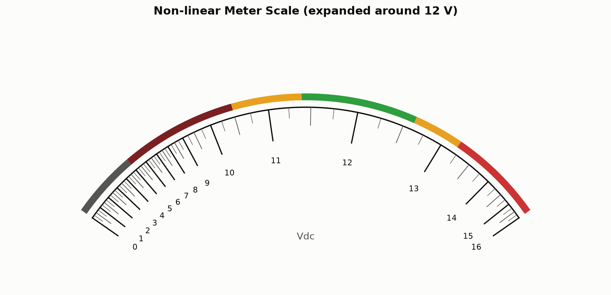
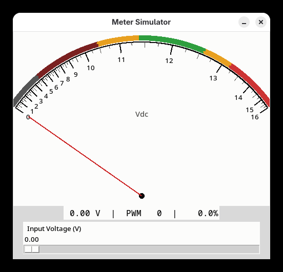
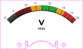

# Non-linear Voltmeter

Arduino-driven 0-16 V panel meter with a Gaussian-weighted non-linear scale that expands resolution around 12 V — designed for monitoring a 12 V DC bus (e.g. Synology NAS power rail).



## Circuit


The bus voltage is fed through a resistor divider (R1/R2/R3) with diode clamping (D1/D2) for overvoltage protection. An L7805CV regulator (U1) powers the Arduino from the same bus. The PWM output is smoothed by C4 before driving the panel meter.

## How it works

A Gaussian sensitivity function concentrates ~60% of the meter's arc in the 10-14 V range, making small deviations from 12 V easy to read at a glance. A Python script integrates this sensitivity curve to produce a 1024-entry ADC-to-PWM lookup table. The Arduino reads voltage via the resistor divider on A1 (scaled 0-16 V to 0-5 V), applies an EMA filter, and drives an 85C1-style panel meter with PWM on pin 5 (D5).

Color bands on the scale face indicate operating zones:

| Band | Range | Meaning |
|------|-------|---------|
| Gray | 0-5 V | Device off |
| Maroon | 5-10.5 V | Brownout / corruption risk |
| Amber | 10.5-11.4 V | Brownout warning |
| Green | 11.4-12.6 V | Safe range (±5%) |
| Amber | 12.6-13.2 V | Overvoltage warning |
| Red | 13.2-16 V | Overvoltage damage |

## Simulator



Interactive Tkinter simulator with needle, slider, and PWM readout:

```
python3 simulator/meter_gui.py
```

## Files

| File | Description |
|------|-------------|
| `firmware/meter.ino` | Arduino sketch — reads ADC, applies LUT, outputs PWM |
| `firmware/generate_lut.py` | Generates the ADC→PWM lookup table (prints Arduino C array) |
| `firmware/meter_lut.csv` | LUT as CSV (`voltage`, `duty_cycle_pct`) |
| `firmware/voltage_mapping.csv` | Full mapping (`bus_voltage`, `meter_voltage`) |
| `scale/generate_cricut_svg.py` | Generates a 1:1 SVG for Cricut "Print Then Cut" |
| `scale/generate_concept.py` | Renders the non-linear scale face as a PNG (matplotlib) |
| `scale/meter_scale_cricut.svg` | Cricut-ready SVG output |
| `scale/meter_scale_cricut_6x3.57cm.png` | Scale face PNG (transparent background) |
| `scale/concept_scale.png` | Concept visualization of the scale |
| `scale/alignment/` | Alignment validation tools and reference photos |
| `circuit/meter.fzz` | Fritzing project file (schematic + breadboard) |
| `circuit/schematic.png` | Circuit schematic |
| `circuit/breadboard.png` | Breadboard layout |
| `simulator/meter_gui.py` | Interactive Tkinter simulator with needle, slider, and PWM readout |
| `simulator/screenshot.png` | Simulator screenshot |

## Tuning

Edit the parameters at the top of `firmware/generate_lut.py`:

- `CENTER` — voltage the scale expands around (default 12.0)
- `SIGMA` — width of the expanded region (default 1.4)
- `BASE_GAIN` / `PEAK_GAIN` — sensitivity floor vs. peak at center

## Custom Scale Face (Cricut)



`scale/generate_cricut_svg.py` generates a 1:1 physical-scale SVG for replacing the factory 0-5 V scale on the Baomain 85C1 with the custom non-linear 0-16 Vdc scale using a Cricut "Print Then Cut" workflow.

```
python3 scale/generate_cricut_svg.py           # produces meter_scale_cricut.svg + .png
python3 scale/generate_cricut_svg.py --ruler   # adds mm ruler ticks for verifying dimensions
```

### Cricut workflow

1. Import `meter_scale_cricut.svg` into Cricut Design Space
2. Select all layers **except** the magenta cut outline → click **Flatten** (merges into a single "Print Then Cut" layer)
3. The magenta cut outline remains as a **Cut** operation
4. Select both the flattened print layer and cut outline → **Attach** (locks relative positioning)
5. Click **Make It** — the Cricut prints the design with registration marks, then cuts the outline
6. Trim and mount the printed scale face onto the meter

### Tuning physical dimensions

All measurements are configurable constants at the top of the script (mm). Print at 100% scale (no fit-to-page) and compare against the original plate. Key parameters:

| Parameter | Default | What it controls |
|-----------|---------|-----------------|
| `PLATE_W` / `PLATE_H` | 60 × 35.7 mm | Overall plate size |
| `ARC_RADIUS` | 31.5 mm | Scale arc radius |
| `PIVOT_X` / `PIVOT_Y` | 30.0 / 39.2 mm | Needle pivot point |
| `NOTCH_W` / `NOTCH_H` | 22.7 / 5.85 mm | Bottom cutout size |
| `TOWER_W` | 1.2 mm | Tower column width flanking the dome |
| `VALLEY_DEPTH` | 2.0 mm | Valley floor height between towers and dome |
| `DOME_N` | 2.283 | Superellipse exponent for dome profile |
| `FILLET_R` | 0.3 mm | Fillet radius at 90° corners |
| `MOUNT_HOLE_*` | 2.5 mm dia, 14/3 mm inset | Screw hole placement |

## License

Public domain — see [UNLICENSE](UNLICENSE).
