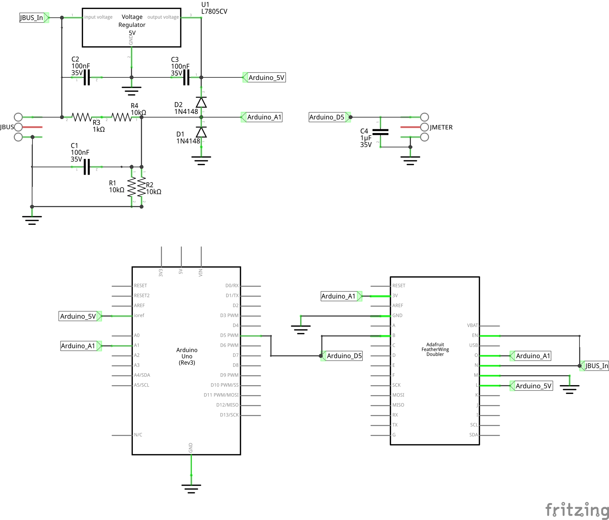
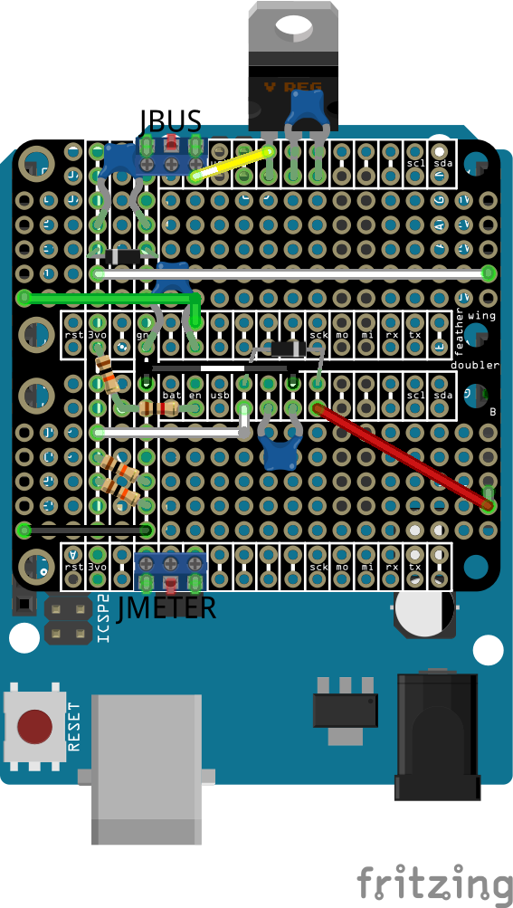

# Non-linear Voltmeter

Arduino-driven 0-16 V panel meter with a Gaussian-weighted non-linear scale that expands resolution around 12 V — designed for monitoring a 12 V DC bus (e.g. Synology NAS power rail).

## Circuit

The bus voltage is fed through a resistor divider (R1/R2/R3) with diode clamping (D1/D2) for overvoltage protection. An L7805CV regulator (U1) powers the Arduino from the same bus. The PWM output is smoothed by C4 before driving the panel meter.

## How it works

A Gaussian sensitivity function concentrates ~60% of the meter's arc in the 10-14 V range, making small deviations from 12 V easy to read at a glance. A Python script integrates this sensitivity curve to produce a 1024-entry ADC-to-PWM lookup table. The Arduino reads voltage via the resistor divider on A1 (scaled 0-16 V to 0-5 V), applies an EMA filter, and drives an 85C1-style panel meter with PWM on pin 5 (D5).

Color bands on the scale face indicate operating zones:

| Band | Range | Meaning |
|------|-------|---------|
| Gray | 0-5 V | Device off |
| Maroon | 5-10.5 V | Brownout / corruption risk |
| Amber | 10.5-11.4 V | Brownout warning |
| Green | 11.4-12.6 V | Safe range (±5%) |
| Amber | 12.6-13.2 V | Overvoltage warning |
| Red | 13.2-16 V | Overvoltage damage |

## Files

| File | Description |
|------|-------------|
| `meter.ino` | Arduino sketch — reads ADC, applies LUT, outputs PWM |
| `genlut.py` | Generates the ADC→PWM lookup table (prints Arduino C array) |
| `meter_scale.py` | Renders the non-linear scale face as a PNG (matplotlib) |
| `meter_gui.py` | Interactive Tkinter simulator with needle, slider, and PWM readout |
| `meter_lut.csv` | LUT as CSV (`voltage`, `duty_cycle_pct`) |
| `voltage_mapping.csv` | Full mapping (`bus_voltage`, `meter_voltage`) |
| `meter.fzz` | Fritzing project file (schematic + breadboard) |
| `meter_schem.png` | Circuit schematic |
| `meter_bb.png` | Breadboard layout |

## Tuning

Edit the parameters at the top of `genlut.py`:

- `CENTER` — voltage the scale expands around (default 12.0)
- `SIGMA` — width of the expanded region (default 1.4)
- `BASE_GAIN` / `PEAK_GAIN` — sensitivity floor vs. peak at center

## License

Public domain — see [UNLICENSE](UNLICENSE).
